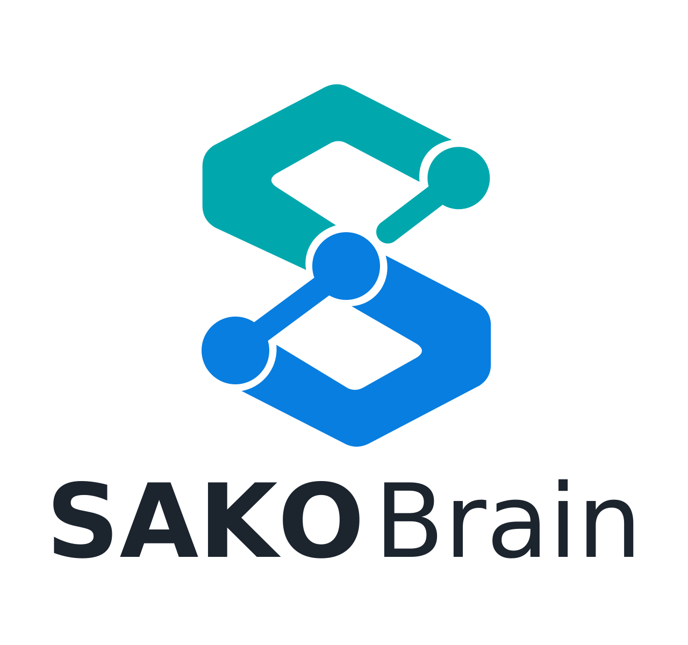

# SAKO Brain

<picture>
  <source media="(prefers-color-scheme: dark)" srcset="SAKO-Brain-Logo-Kit/sako-brain-dark.png">
  
</picture>

**Structured Augmented Knowledge Orchestrator** —<br>
**S**tructured knowledge, projects, decisions, timeline and context;<br>
**A**ugmented by AI, tooling, indexing and automation;<br>
**K**nowledge and context at the core; an<br>
**O**rchestrator that coordinates knowledge, rules, context and the tools and agents that use them.

An open-source knowledge system for organizing projects, decisions, context and
AI-assisted workflows — a local-first personal knowledge and project-management
CLI. Your notes are plain Markdown files with YAML frontmatter, in directories
you can read, edit and back up with anything. The search index, integrity
manifests and logs are a rebuildable cache that lives **outside** your notes —
so the vault stays Markdown and configuration, and nothing else.

It works from a plain text editor with no AI, no account and no network.

**Current release: 0.14.3.** Pre-1.0 means the command line and configuration
format may still change; your notes will not — they are text.

## Why it exists

Notes accumulate faster than structure does. Most tools answer this by owning
your data: a database, a sync service, an account. That trade buys convenience
and costs control — you cannot grep it, you cannot diff it, and you cannot take
it somewhere else without an export feature someone else maintains.

Sako Brain takes the other side. The files are the system. Everything the
program adds — full-text search, link and integrity checking, project records,
decision records, a timeline, session handoffs — is derived from those files
and can be thrown away and rebuilt with one command. If the program disappears
tomorrow, you still have a directory of Markdown.

It also assumes AI agents will read and write your notes, and treats that as a
*client* concern rather than a feature. `brain agents-doc --write` generates an
`AGENTS.md` describing the vault's data model and rules in a provider-neutral
way, which any agent — or person — can read. It is **opt-in**: nothing about
the vault assumes an agent is involved, and `brain init` does not create one.

## What it does not do

Being explicit, because these are reasonable things to expect and none of them
is true:

- **No cloud service, no account, no telemetry.** Nothing leaves your machine.
- **No sync.** Put your vault in whatever you already sync, or don't.
- **No web or graphical interface.** It is a command-line tool.
- **No AI built in.** It produces context *for* agents; it does not call one.
- **Not a note-taking editor.** Use your own; the files are ordinary Markdown.
- **No automatic backup.** Backup is opt-in and unconfigured until you set it up.

## Requirements

- **Python 3.11 or newer.** Tested on 3.11 and 3.14.
- **SQLite built with FTS5**, which powers search. Present in essentially every
  mainstream build; `brain doctor` reports it if missing. It is a property of
  your Python's `sqlite3` module and cannot be installed by pip.

### Platform support

| | |
|---|---|
| **Linux** | Supported and tested. |
| **macOS** | Expected to work but not tested. Reports welcome. |
| **Windows** | Not supported. File permissions rely on POSIX mode bits. |
| Scheduled backups | Linux with systemd only. |

### Optional external tools

None is a Python dependency, and pip will never install them. Each enables one
feature; without it, that feature says so and everything else works.

| Tool | Enables |
|---|---|
| `git` | `brain git` — local version history for your vault |
| `restic` (and `rclone` for remote destinations) | `brain backup` — encrypted, versioned backups |
| `systemd` | scheduled backup and maintenance timers |

## Install

Sako Brain is **not on PyPI**. Install the wheel from the
[latest release](https://github.com/Sako404/sako-brain/releases/latest):

```sh
pipx install ./sako_brain-0.14.3-py3-none-any.whl
```

Each release lists the SHA-256 of its artefacts, so you can check what you
downloaded:

```sh
sha256sum ./sako_brain-0.14.3-py3-none-any.whl
```

Or build from source:

```sh
git clone https://github.com/Sako404/sako-brain.git
cd sako-brain
python -m build
pipx install ./dist/sako_brain-0.14.3-py3-none-any.whl
```

`pipx` puts `brain` on your PATH and keeps it isolated. A plain virtualenv
works too:

```sh
python -m venv ~/.venvs/brain
~/.venvs/brain/bin/pip install ./dist/sako_brain-0.14.3-py3-none-any.whl
```

Either way, exactly one dependency is installed: PyYAML.

### Update and uninstall

```sh
pipx install --force ./dist/sako_brain-0.14.3-py3-none-any.whl
pipx uninstall sako-brain
```

Uninstalling removes the program. It never touches a vault, its runtime state
or its backups.

## First run

```sh
brain init ~/brain
```

Creates the vault, its directories and a commented configuration file, then
runs `brain doctor` and prints the result. It does **not** create an
`AGENTS.md` — see below.

It never overwrites anything. Run it again on an existing vault and it refuses;
with `--force` it fills in only what is missing and still leaves your
configuration and notes untouched.

Useful flags: `--git` also initialises version history. `--no-agents` is
accepted but does nothing — it is kept only so scripts written against 0.1.0
keep working.

### Agent rules are opt-in

```sh
brain agents-doc --write
```

Writes `AGENTS.md` at the vault root, rendered from that vault's own
configuration, describing the data model and rules in a provider-neutral way.
Run it whenever you want one; nothing else needs it, and a vault without one is
complete and passes `brain doctor`.

### Look around first

```sh
brain init --demo /tmp/example-brain
brain --vault /tmp/example-brain index
brain --vault /tmp/example-brain search observatory
```

Creates a small synthetic vault — fictional content, a deliberately different
directory layout, a custom note type — so you can see the shape of the thing
before committing to one. Safe to delete. Do not use `--demo` for a vault you
intend to keep.

## Everyday use

```sh
brain remember --type fact --title "Postgres upgrade window is Sunday 02:00"
brain index                 # rebuild the search index
brain search postgres
brain status                # counts, inbox, projects
brain doctor                # health checks: links, duplicates, secrets, layout
brain integrity             # point-in-time report with a file manifest
```

Also: `brain projects` / `brain project` for project records, `brain timeline`
for dated events, `brain handoff` for session notes, `brain agents-doc` to
regenerate `AGENTS.md`, `brain context --json` for feeding an agent one
question's worth of context, and `brain state --json` for a deterministic,
read-only snapshot of the whole vault's operational state (projects,
decisions, memory queue, handoffs, doctor, recent timeline, systemd timers) —
built for a script or a scheduled summary to consume, not for asking a
question. `brain update <id> --set key=value --append-text "..."` sets
frontmatter fields and/or appends a dated note to an existing note by id,
without touching anything else in it. `brain decision create --title ...`
creates a decision record from the decision template (and, with
`--supersedes`, links an older one forward without editing its content);
`brain project create/update/close` register a project, move its record
between status folders, and keep the registry entry in sync — all without
touching anything else in the vault. `brain note create --type <person|
knowledge|document|fact> --title ...` creates a note at its canonical
destination (a fixed bucket for person/knowledge/document; `--area <name>`
for fact, validated against real existing areas); `brain timeline add
--title ... --date ...` creates a dated event from the event template.
Neither ever takes a client-supplied filesystem path. `brain project
section-update <id> --section <name> --mode replace|append --content
"..."` edits one allowlisted section of a project record (`Current
state`, `Milestones`, `Problems / limitations`, `Next actions`) without
touching any other section — the position is found by parsing the note's
own headers, never a supplied path or line range.

## Where things live

| | |
|---|---|
| Vault | wherever you create it — Markdown and configuration only |
| Vault configuration | `<vault>/90_SYSTEM/config.yaml` |
| Runtime state (index, logs, manifests) | `$XDG_STATE_HOME/sako-brain/vaults/<vault>-<id>/` |
| Git metadata | `$XDG_DATA_HOME/sako-brain/git/<vault>-<id>.git` |
| Default vault (optional) | `$XDG_CONFIG_HOME/sako-brain/config.yaml` |

Runtime state is outside the vault deliberately: the search index contains full
note bodies, and a SQLite file rewritten on every `brain index` inside a synced
folder is the same hazard as a live `.git/`.

Which vault a command acts on, most explicit first: `--vault PATH`, the
`BRAIN_ROOT` environment variable, a `90_SYSTEM/config.yaml` found by walking
up from the current directory, then `vault_path:` in the per-user config. If
none of those answers, it refuses rather than guessing.

The directory layout, note types and status vocabularies are all configurable
by role, so an existing notes folder can be adopted without renaming anything.

## Remote canonical Brain

By default, "which vault" resolves to something on this machine (see
"Where things live" below). If your canonical Brain instead lives on a
server you reach over SSH — a home server, a small VPS, anything running
its own `brain` behind an SSH forced-command dispatcher — `brain setup`
configures this client to talk to it transparently: every command (other
than `setup`, `integration`, and `init`) then proxies over SSH instead of
resolving a local vault, with no wrapper script to write or maintain.

```sh
# One-time: see this server's host key(s) for out-of-band verification
brain setup --show-host-key --server brain.example.com --port 2222
# ...verify the fingerprint against what the server admin published, save
# the printed key lines to a file, then:
brain setup --server brain.example.com --port 2222 --user brain \
  --read-identity ~/.ssh/brain-read --write-identity ~/.ssh/brain-write \
  --known-hosts-file ./verified-host-keys
```

This writes `~/.config/sako-brain/{client.toml,ssh_config,ssh_known_hosts}`
— a brain-owned SSH config (`ssh -F`, so the system-wide SSH config is
never consulted), strict host-key checking against the dedicated
known_hosts file it just wrote, no agent/X11 forwarding. Read and write
operations use separate SSH identities if you gave both; which identity
can actually do what is enforced by the server's own dispatcher, not
guessed client-side. No secret is ever written into the vault or this
repository — private keys stay exactly where you point `brain setup` at.

## Agent integrations

Official, generic Claude Code and Codex integrations ship inside this
package — install them with one command each:

```sh
brain integration install claude-code
brain integration install codex
```

Claude Code gets 15 skills symlinked into `~/.claude/skills/` (covering
the day-to-day workflow: search, remember, decisions, timeline, projects,
handoffs, session close, and more) plus an MCP server registration in
`~/.claude.json`. Codex gets an MCP server registration in
`~/.codex/config.toml` plus a generic Brain-usage section merged into
`~/.codex/AGENTS.md` between marker comments. Both commands are
idempotent and merge-safe — re-running after an upgrade updates what they
installed and leaves everything else (other skills, other MCP servers,
the rest of your config files) untouched.

```sh
brain integration doctor            # both, human-readable
brain integration doctor --json     # both, machine-readable
brain integration doctor claude-code
brain integration doctor codex
brain integration uninstall claude-code
brain integration uninstall codex
```

`doctor` checks package version, client config, SSH config, canonical
Brain connectivity, MCP bridge startup and advertised capabilities, skills
installed, and both agents' registration — printing no secret values.
`uninstall` removes only what the installer added.

Skills and integration instructions are versioned with the Brain release
that ships them — there is no separate skills repository or compatibility
matrix to track. Upgrade `sako-brain` and re-run `install` to update them.

See `brain integration install claude-code --help` /
`... codex --help`, or the packaged READMEs
(`brain.integrations.claude-code`, `.codex`, `.mcp` — readable via
`python -c "from importlib.resources import files; print((files('brain')/'integrations/claude-code/README.md').read_text())"`
if you'd rather not install first) for the full detail.

## Remote / web AI access

`brain remote-gateway` is an optional, self-hosted OAuth 2.1 + Streamable
HTTP MCP server so ChatGPT web, Claude.ai web, or any other MCP-over-HTTPS
client — including a local agent runtime with a native remote-MCP-with-OAuth
client, such as Hermes Agent — can reach your canonical Brain live, without
ever touching the vault filesystem, SSH, or bypassing Brain's write
safety. Every tool call it handles is forwarded, unmodified, to the same
`brain.mcp_bridge` dispatch Claude Code and Codex already use. No client
gets special-cased code — the same OAuth/MCP surface serves all of them
identically.

```sh
pip install 'sako-brain[remote-gateway]'
brain setup --server ... --read-identity ... --write-identity ... --known-hosts-file ...
brain remote-gateway init --canonical-uri https://your-hostname/mcp
brain remote-gateway set-owner-password
brain remote-gateway serve
```

Three scopes (`brain.read`, `brain.write`, `brain.restricted`), a human
consent screen for every new client, and a one-command kill-switch
(`brain remote-gateway revoke-all`) that cuts off every remote web AI
connection without touching Claude Code, Codex, or any local client. Full
architecture, security model, deployment guidance, and client connection
steps: [docs/REMOTE_ACCESS.md](docs/REMOTE_ACCESS.md).

## Multi-user: private and shared knowledge

Optional, opt-in, and additive — a single-user vault needs none of this.
Enable it and one canonical Brain can serve several people, each with
their own private records and deliberately shared ones, without separate
vaults, separate indexes, or separate installations:

- **Principals and groups.** `brain principal create` / `brain group
  create` register who can act, and which groups decide who may see a
  shared record. Local-CLI-only by construction — never reachable over
  the remote gateway or the SSH dispatcher, for any role, admin
  included.
- **Private and shared logical spaces.** Every record carries
  `owner_principal` / `audience` in its own frontmatter — read live off
  the file itself, never trusted from a cached index. A record's owner
  may modify it; audience membership grants read only, never edit —
  there is no separate editors/grants subsystem. New records default to
  private; sharing is always an explicit, visible choice.
- **Role policy.** A minimal, generic capability layer — not
  hardcoded role names, deployment configuration keyed by whatever
  string is in a principal's own `role` field: whether that role may
  write `sensitivity: restricted` content at all, and which audience
  targets it may share its own records with. **Fails closed**: a role
  that can't resolve a valid policy (typo, deleted record, deployment
  drift) never silently becomes permissive — the strictest point in the
  whole capability space, not the most permissive one.
- **Admin carries no silent bypass.** An admin principal's own ordinary
  reads and writes still go through the exact same ownership/audience
  checks as everyone else's; admin status only gates two operational
  tools (`brain doctor`, `brain state`). Recovery from a locked-out
  state is a separate, explicit, audited break-glass path — never an
  implicit side effect of being admin.
- **Provenance and audit.** Every write logs who (principal), how (CLI,
  MCP, remote gateway), and through which transport — append-only, on
  disk, outside the vault. Nothing is silently attributed to a default
  identity. (A dedicated `brain` command to query it is not shipped yet
  — see Roadmap.)

## Optional features

**Git.** `brain git init` starts version history in a directory outside the
vault, leaving only a small pointer file inside it. Entirely optional — the
vault works with git absent from the machine.

**Backup.** `brain backup` wraps [restic](https://restic.net/) for encrypted,
deduplicated, versioned backups. It ships **no default destination**: set
`backup_repo:` (a filesystem path) or `backup_rclone_remote:` plus
`backup_rclone_repo_path:` in your vault's config, and keep the repository
password in a file outside the vault. Until you do, `brain backup` tells you
which key is missing. It never runs on its own.

## MCP servers

Two stdio MCP servers ship in this package, for two different deployment
shapes — neither is auto-wired by `brain init`; point an MCP-capable client
at whichever one fits, in its own config.

- **`python3 -m brain.mcp_server`** — shipped since 0.1.0. Calls Brain's
  Python business logic in-process, against whatever vault the usual
  `--vault` / `BRAIN_ROOT` / config-file resolution finds on this machine.
  Correct when Brain *is* local to wherever the MCP client runs.
- **`python3 -m brain.mcp_bridge`** — shipped in 0.9.0. Reaches Brain
  *exclusively* by shelling out to the already-installed `brain` CLI
  executable, one subprocess call per tool — never a direct vault or
  library call, never a second copy of Brain's business logic. Use this
  when the real vault is reachable only through the `brain` CLI's own
  transport — including the transparent SSH proxy to a remote canonical
  Brain that `brain setup` configures (see "Remote canonical Brain" above)
  — so `mcp_server.py` run directly would find no vault, or silently serve
  a stale local copy. Zero new credentials, zero new server-side surface:
  the bridge inherits whatever `brain` itself is configured to do. This is
  the server `brain integration install claude-code` / `... codex`
  register by default, since it works identically whether Brain is local
  or remote.
  `tools/list` reports Brain's real tool names (from `brain capabilities`,
  never a second hand-kept list) filtered to exactly the ones this bridge
  can execute — it will never advertise a tool `tools/call` would then
  refuse. As of v0.10.0 this covers the full day-to-day workflow (search,
  context, state, projects, decisions, notes, timeline, handoffs) — see
  `brain/mcp_bridge.py`'s own docstring, or `tools/list` itself, for the
  exact set and the two tools deliberately excluded (one a security
  boundary, one a deprecated redundant tool).

## Roadmap

Not implemented, and not promised for any date: editor- and agent-specific
rule packs beyond `AGENTS.md`, macOS verification, PyPI distribution, a
`brain` command to query the audit log (it is written, just not yet
readable without direct file access), self-service credential rotation
for a non-admin remote-gateway principal (today only an admin with local
access can set one), and passkey/WebAuthn login for the remote gateway
(password-only today). Everything else described above this section
exists today.

## Contributing

Contributions are welcome, though this is a small project and review may be
slow. See [CONTRIBUTING.md](CONTRIBUTING.md) for setup, tests and expectations.

Source: <https://github.com/Sako404/sako-brain>

## Support

Best-effort. This is a personal project shared publicly: there is no service
level, no guaranteed response time and no commercial support. Bug reports and
questions go to [Issues](https://github.com/Sako404/sako-brain/issues) and are
read.

For **security issues**, do not open a public report — see
[SECURITY.md](SECURITY.md).

## Licence

Copyright (C) 2026 Marcin Sakowski.

Licensed under the **GNU Affero General Public License, version 3 or later**.
In short: you may use, study, modify and redistribute it, and if you distribute
a modified version — including running it as a network service — you must offer
the corresponding source under the same licence. See [LICENSE](LICENSE) for the
full text.

The name is not covered by that licence; see [TRADEMARK.md](TRADEMARK.md).
